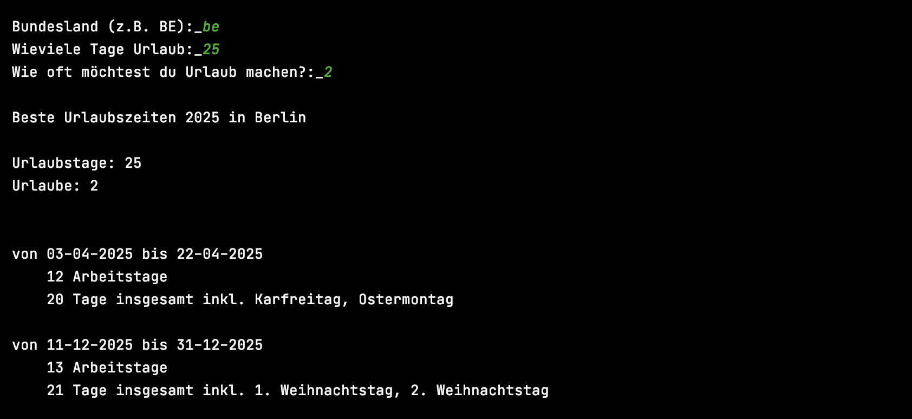

# Urlaubsplaner

Plane deine Urlaubszeit schnell und effizient mit:

- Auswahl deines Bundeslands
- Auswahl des Jahres
- Angabe der Anzahl der Urlaubstage
- Angabe der Anzahl der Urlaube

Die Anwendung nutzt die Feiertage des gewählten Bundeslands über die API von [api-feiertage.de](https://api-feiertage.de) und berechnet die Start- und Endtermine für jeden Urlaub. Dabei wird eine maximale Ausnutzung der Feiertage angestrebt, um die Urlaubstage optimal zu verlängern.

